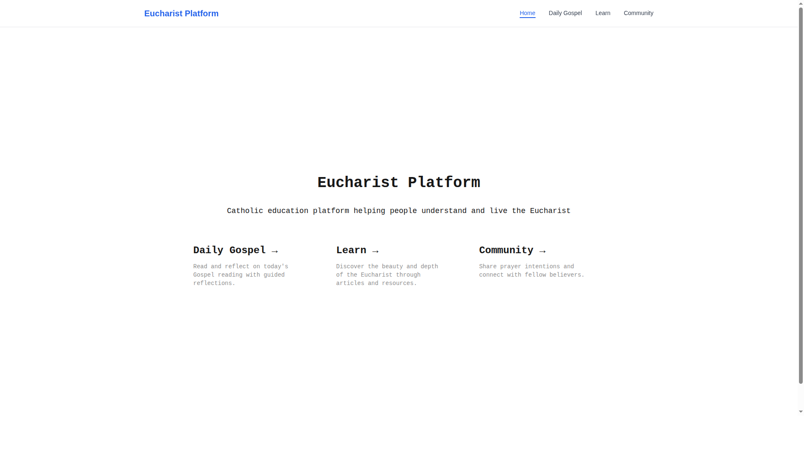
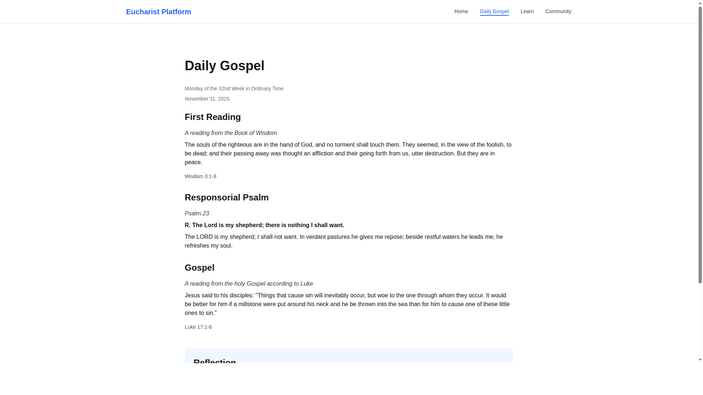
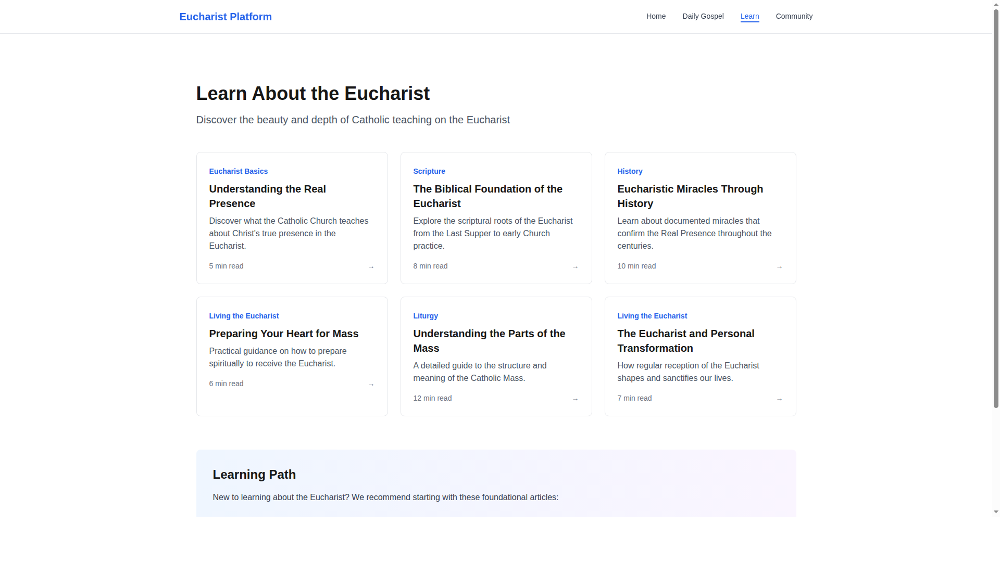
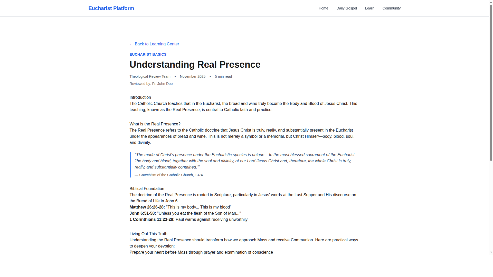
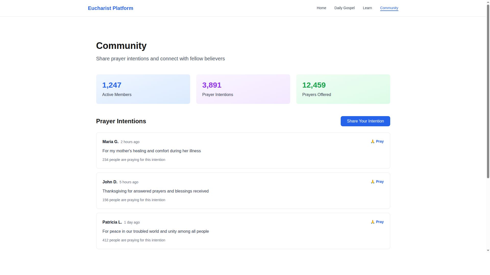

# Route Implementation Screenshots

This directory contains screenshots of the implemented Next.js App Router structure.

## Pages Implemented

### Home Page (`/`)

- Navigation bar with active route highlighting
- Three feature cards linking to main sections
- Responsive layout

### Daily Gospel (`/gospel`)

- Liturgical calendar information
- Scripture readings (First Reading, Psalm, Gospel)
- Reflection section

### Learn Section (`/learn`)

- Grid of educational articles
- Category badges and read times
- Recommended learning path

### Article Detail (`/learn/[slug]`)

- Dynamic route based on article slug
- Rich content with sections and quotes
- Navigation back to Learn section

### Community (`/community`)

- Community statistics
- Prayer intentions feed
- Community guidelines

## Navigation

All pages include a fixed top navigation bar that:
- Highlights the current route
- Provides links to all main sections
- Maintains consistent branding

## Technical Details

- **Framework**: Next.js 14 with App Router
- **Styling**: Tailwind CSS
- **Routing**: File-system based routing
- **Components**: React Server Components (default) with Client Components for interactivity

See `/web/frontend/ROUTING.md` for detailed routing documentation.
